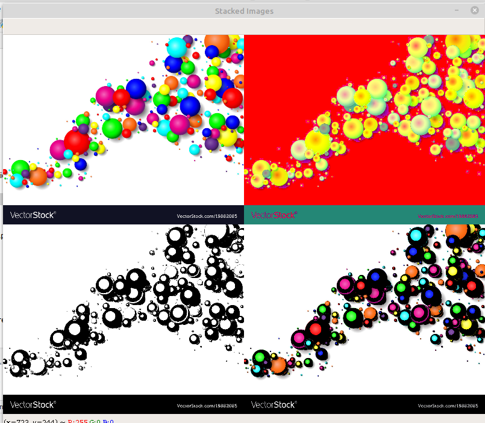

--> Imformation About This Stack Function

Syntex Of Function:
            stackImages(Scale,imgArray)

Example:---
imgStack = stackImages(0.5,([img,imgGray,img],[img,img,img]))

---> Output 4 Image in One Frame <----

